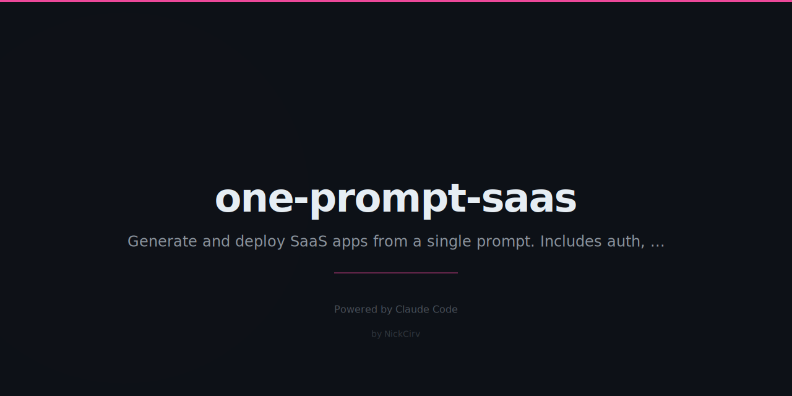

# one-prompt-saas

> One prompt. One command. Full deployed SaaS.

[](https://www.npmjs.com/package/one-prompt-saas)
[](LICENSE)
[](https://github.com/NickCirv/one-prompt-saas/stargazers)

## The Problem

Building a SaaS takes weeks of scaffolding, auth, database setup, deployment config, and glue code you've written four times before. What if Claude could read one spec and ship the whole thing — routes, schema, frontend, deployment, and all?

This repo contains 5 carefully engineered prompts. Each one, when given to Claude Code, produces a complete, deployable application. No back-and-forth. No gaps. No "you'll need to add auth yourself."

## Quick Start

```bash
npx one-prompt-saas
```

Pick a template. A directory is created with a `CLAUDE.md`. Open Claude Code in it. Come back to a working app.

Or go fully hands-off:

```bash
# Skip prompts, auto-launch Claude Code
npx one-prompt-saas --template todo-saas --name my-todos --auto
```

## Example Output

```
$ npx one-prompt-saas

  ┌─────────────────────────────────────────────┐
  │        ONE PROMPT SAAS                      │
  │        One prompt. One command. Shipped.    │
  └─────────────────────────────────────────────┘

  Pick a template:
  ❯ Todo SaaS           — Auth, tasks, categories, due dates
    URL Shortener       — Links + click analytics dashboard
    Pastebin            — Code sharing, syntax highlight, expiry
    Status Page         — Service monitor, incidents, alerts
    Invoice Generator   — PDF invoices, Stripe-ready checkout

  Project name: my-invoicr

  Creating project at ./my-invoicr...
  ✔  CLAUDE.md written (148 lines)
  ✔  render.yaml written
  ✔  Dockerfile written
  ✔  .gitignore written

  Next:
    cd my-invoicr
    claude --dangerously-skip-permissions

  Or run with --auto to launch Claude Code now.
```

After Claude builds it:

```
$ cd my-invoicr && npm start

  Server running on http://localhost:3000
  Database: SQLite at ./data/app.db
  Routes: 14 registered
  Auth: JWT (access 15m / refresh 7d)
```

## Features

- 5 production-ready templates: Todo SaaS, URL Shortener, Pastebin, Status Page, Invoice Generator
- Every template specifies complete database schema, all API routes, frontend pages, deployment config
- Auto mode launches Claude Code immediately — come back to a built app
- Generated apps include `render.yaml` for one-click Render deployment and `Dockerfile` for containerized hosting
- Prompts are ~120–150 lines each — enough detail that Claude builds without guessing

## Templates

| Template | What It Builds | Stack |
|----------|---------------|-------|
| Todo SaaS | Full todo app with auth, categories, due dates | Express + SQLite + JWT |
| URL Shortener | Link shortener with click analytics dashboard | Express + SQLite (LRU cache) |
| Pastebin | Code sharing with syntax highlighting + expiry | Express + SQLite + Highlight.js |
| Status Page | Service monitoring with incident history + alerts | Express + SQLite + Nodemailer |
| Invoice Generator | PDF invoices with Stripe-ready checkout | Express + SQLite + PDFKit + Stripe |

## How It Works

1. Run `npx one-prompt-saas` and pick a template
2. A new directory is created with a complete `CLAUDE.md` spec
3. Open Claude Code in that directory (or use `--auto` to launch it immediately)
4. Claude reads the spec and builds the entire application — schema, routes, frontend, deployment config
5. Run `npm install && npm start` — it works

The magic is not AI. It is prompt engineering. A well-written spec gets a well-built app.

## What Each Prompt Specifies

- Complete database schema (SQL DDL)
- Every API route with request/response shape
- Validation rules and exact error formats
- Frontend pages, interactions, and design tokens
- Deployment config (`render.yaml` + `Dockerfile`)
- A final checklist Claude verifies before finishing

## Requirements

- Node.js 18+
- Claude Code (`npm i -g @anthropic-ai/claude-code`) — only required for `--auto` mode

## See Also

- [zero-to-prod](https://github.com/NickCirv/zero-to-prod) — Speedrun: empty directory to deployed app
- [clone-any-app](https://github.com/NickCirv/clone-any-app) — Describe an app, Claude clones it
- [sleep-and-ship](https://github.com/NickCirv/sleep-and-ship) — Queue builds overnight, wake up to shipped code

## License

MIT — [NickCirv](https://github.com/NickCirv)
