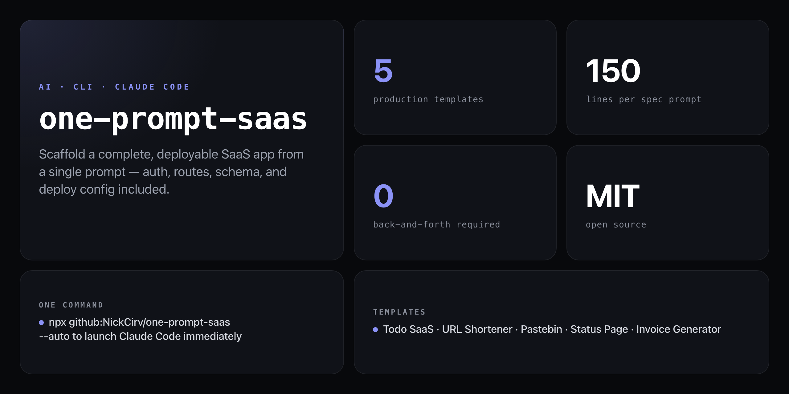

<div align="center">

**One prompt. One command. A complete, deployable SaaS — auth, routes, schema, and deploy config included.**


</div>

---

Building a SaaS takes weeks of scaffolding: auth, database setup, deployment config, and glue code you've written four times before. `one-prompt-saas` packages five carefully engineered specs — each ~150 lines — that Claude Code can read once and turn into a complete, running application. No back-and-forth. No gaps. No "you'll need to add auth yourself."

```
$ npx github:NickCirv/one-prompt-saas

  ⚡ one-prompt-saas
  One prompt. One command. Full deployed SaaS.

  Pick a template:
  ❯ Todo SaaS           — Auth, tasks, categories, due dates
    URL Shortener       — Links + click analytics dashboard
    Pastebin            — Code sharing, syntax highlight, expiry
    Status Page         — Service monitor, incidents, alerts
    Invoice Generator   — PDF invoices, Stripe-ready checkout

  Project name: my-invoicr

  Creating project at ./my-invoicr...
  ✔  CLAUDE.md written (148 lines)
  ✔  render.yaml written
  ✔  Dockerfile written
  ✔  .gitignore written

  Next:
    cd my-invoicr
    claude --dangerously-skip-permissions

  Or run with --auto to launch Claude Code now.
```

## Install

No npm account needed — runs straight from GitHub:

```bash
npx github:NickCirv/one-prompt-saas
```

## Usage

```bash
# Interactive: pick template + project name via prompts
npx github:NickCirv/one-prompt-saas

# Non-interactive: specify everything, skip prompts
npx github:NickCirv/one-prompt-saas --template todo-saas --name my-todos

# Fully hands-off: scaffold + launch Claude Code immediately
npx github:NickCirv/one-prompt-saas --template invoice-generator --name my-invoicr --auto
```

| Flag | Description |
|------|-------------|
| `--template <name>` | Skip template selection. One of: `todo-saas`, `url-shortener`, `pastebin`, `status-page`, `invoice-generator` |
| `--name <name>` | Skip project name prompt. Lowercase, hyphens, numbers only |
| `--auto` | Launch Claude Code immediately after scaffolding (`claude --dangerously-skip-permissions`) |

## Templates

| Template | What it builds | Stack |
|----------|---------------|-------|
| `todo-saas` | Full todo app — auth, categories, due dates | Express + SQLite + JWT |
| `url-shortener` | Link shortener with click analytics dashboard | Express + SQLite (LRU cache) |
| `pastebin` | Code sharing with syntax highlighting + expiry | Express + SQLite + Highlight.js |
| `status-page` | Service monitoring, incident history + email alerts | Express + SQLite + Nodemailer |
| `invoice-generator` | PDF invoices with Stripe-ready checkout | Express + SQLite + PDFKit + Stripe |

## What each spec includes

Every `CLAUDE.md` prompt specifies:

- Complete database schema (SQL DDL — no ambiguity)
- Every API route with exact request/response shape
- Validation rules and error formats
- Frontend pages, interactions, and design tokens
- Deployment config (`render.yaml` + `Dockerfile`)
- A final checklist Claude verifies before calling it done

The magic is not AI. It is prompt engineering. A well-written spec gets a well-built app.

## How it works

1. Run `npx github:NickCirv/one-prompt-saas` and pick a template
2. A directory is created with a complete `CLAUDE.md` spec inside
3. Open Claude Code in that directory (or use `--auto` to launch it immediately)
4. Claude reads the spec and builds the full application — schema, routes, frontend, deploy config
5. `npm install && npm start` — it works

## Requirements

- Node.js 18+
- [Claude Code](https://github.com/anthropics/claude-code) — only required for `--auto` mode

## What it is NOT

- **Not a code generator in the traditional sense.** It produces a structured spec that Claude Code interprets — the LLM writes the actual code, not this tool.
- **Not a magic "works every time" button.** Output quality depends on Claude's capability and context window. The specs are engineered for reliability, not guaranteed correctness.
- **Not a deployment tool.** The scaffolded `render.yaml` and `Dockerfile` are ready to use, but you still connect your own accounts and environment variables.

## See also

- [zero-to-prod](https://github.com/NickCirv/zero-to-prod) — Empty directory to deployed app
- [clone-any-app](https://github.com/NickCirv/clone-any-app) — Describe an app, Claude clones it
- [sleep-and-ship](https://github.com/NickCirv/sleep-and-ship) — Queue builds overnight, wake up to shipped code

---

<div align="center">
<sub>Node 18+ · MIT · by <a href="https://github.com/NickCirv">NickCirv</a></sub>
</div>
